# Sistema mecatrónico de medicion de longitud

  
  
  
  

---
El proyecto digitaliza el proceso de corte mediante sensores de precisión y una interfaz HMI, eliminando el error humano del flexómetro convencional, reduciendo el desperdicio de material y garantizando la repetibilidad técnica en la fabricación de carpintería de aluminio
**Tipo de Proyecto:** Investigación y Desarrollo (I+D) / Prototipo Funcional | Año: 2024

## 🎯 Contexto, Desafío y Visión General

En la industria de la carpintería de aluminio, las máquinas automatizadas de medición y corte ya existen en el mercado internacional. Sin embargo, para la industria local, la adquisición de estos equipos representa un alto costo de inversión (CAPEX) y barreras logísticas de importación.

Este proyecto de I+D nació con un doble propósito:

1. **Validación Tecnológica Local:** Demostrar la viabilidad de diseñar y fabricar maquinaria mecatrónica industrial en Bolivia, reduciendo la dependencia de tecnología cerrada extranjera.
2. **Optimización de Procesos:** Desarrollar un **sistema de medición y tope automatizado** acoplado a una sierra ingletadora convencional, que iguale la repetibilidad técnica y las funciones de optimización de material de los equipos importados, pero a una fracción del costo.

El resultado es un prototipo funcional que digitaliza el posicionamiento, elimina el error humano en la medición y establece una base sólida para el desarrollo de maquinaria a medida para el sector industrial.

## ⚙️ Tecnologías y Componentes Utilizados

### Hardware e Integración
1. **Hardware e Integración:** Microcontrolador principal: ESP32 (Módulo DevKitC V4 de 38 pines) encargado del procesamiento en tiempo real y la ejecución del lazo de control PID.
2. **Sensores de posición:** Encoder óptico de cuadratura HDS400 (configurado por interpolación para alta precisión) y finales de carrera electromecánicos para la calibración de inicio (Home).
3. **Actuadores:** Motor DC de 24V NISCA NA4056U con caja reductora (relación 78.2:1), manejado mediante un driver de potencia DRV8871.
4. **Interfaz HMI:** Pantalla inteligente táctil Nextion de 7" (NX8048T070-011) en comunicación serial , combinada con un teclado numérico matricial para un ingreso de datos robusto por el operario.
5. **Ingeniería de detalle:** Diseño de PCB a medida desarrollado en EasyEDA. Se implementó un diseño de fuentes independientes para aislar la etapa de control de la etapa de potencia, garantizando inmunidad ante el ruido electromagnético de los motores y la sierra.

### Software y Diseño:

1. **Firmware:** C/C++ enfocado en el control de movimiento. Se desarrolló un algoritmo de Control PID continuo/discreto para asegurar un posicionamiento suave y exacto del motor.
2. **Diseño CAD Mecánico:** Modelado estructural de la mesa, cálculo de deflexión de la viga base y diseño del sistema de transmisión por correa de distribución.
3. **Diseño Electrónico (EDA):** Elaboración de esquemáticos, ruteado de pistas y modelado 3D de la placa base en EasyEDA.

## 📸 Galería del Proyecto y Validación Técnica

### ⚡ Ingeniería Electrónica y Control
En esta sección se muestra el diseño de hardware y la sintonización del lazo de control para el posicionamiento preciso.

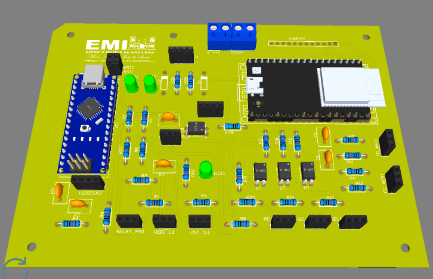
*Vista 3D del diseño de la PCB desarrollado en EasyEDA*

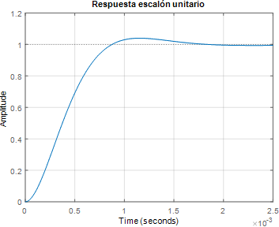
*Gráfica de sintonización del control PID: Análisis de la respuesta del motor ante el escalón de posición.*

---

### 🖥️ Interfaz HMI (Human-Machine Interface)
Se desarrolló una interfaz táctil intuitiva para que el operario pueda calibrar y operar la máquina sin necesidad de conocimientos técnicos avanzados.

<table style="width:100%">
  <tr>
    <td>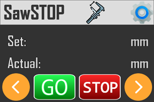</td>
    <td>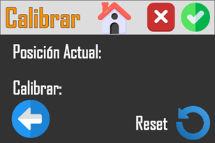</td>
  </tr>
</table>
*Izquierda: Pantalla principal de operación. Derecha: Menú de calibración del sistema.*

<table style="width:100%">
  <tr>
    <td>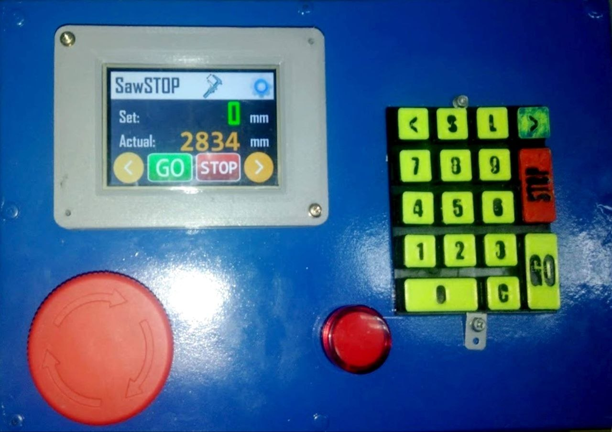</td>
    <td>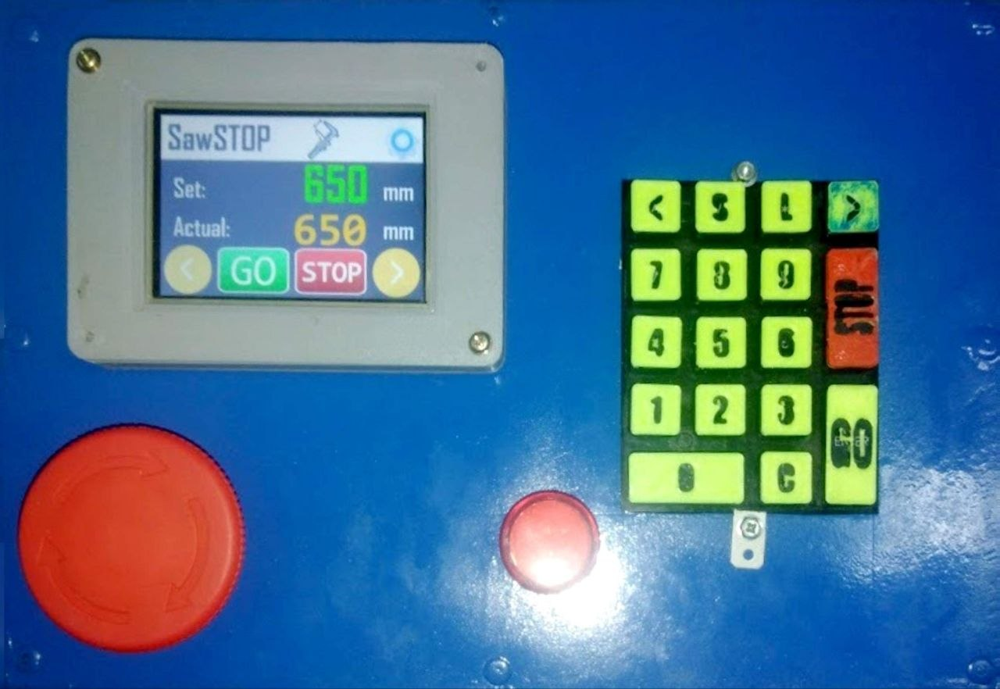</td>
  </tr>
</table>
*HMI interfaz táctil en tiempo real la posicion del tope longitudinal.*

---

### 🔧 Diseño Mecánico y Transmisión
Detalle de la adaptación del sistema de medición.

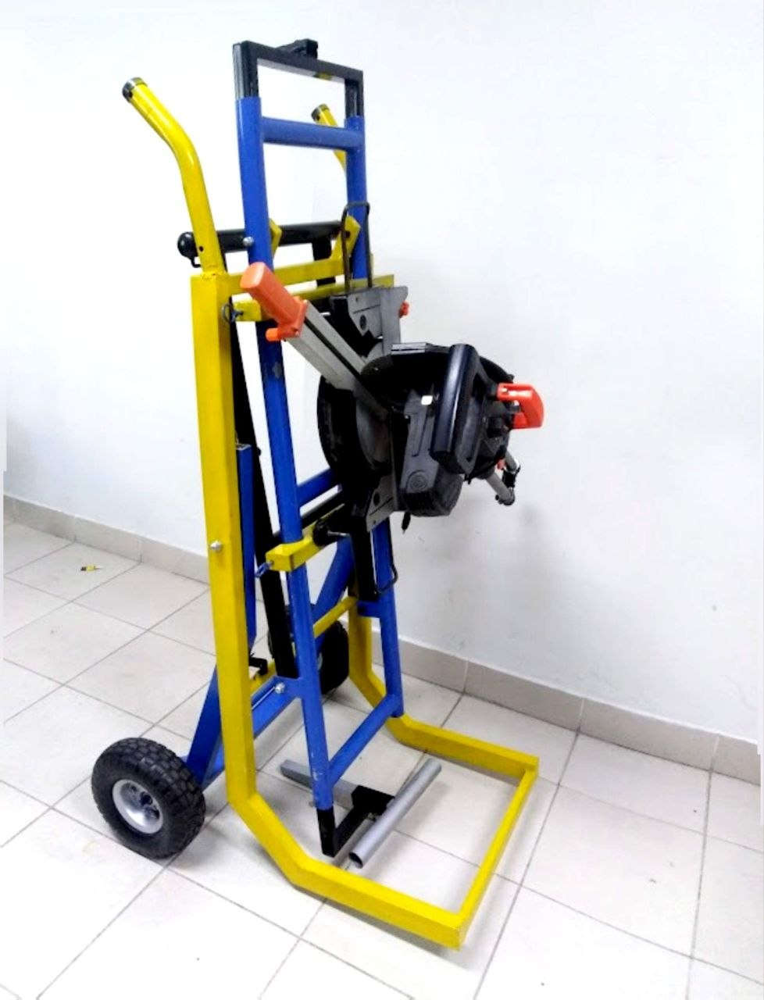

*Detalle del sistema de soporte del sierra ingletadora*

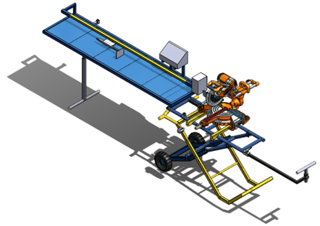
*Integración mecánica completa del sistema de medición sobre la estructura base.*

---

### 🏗️ Pruebas de Campo y Operación
Validación del sistema en un entorno de trabajo real, verificando la repetibilidad y precisión milimétrica.

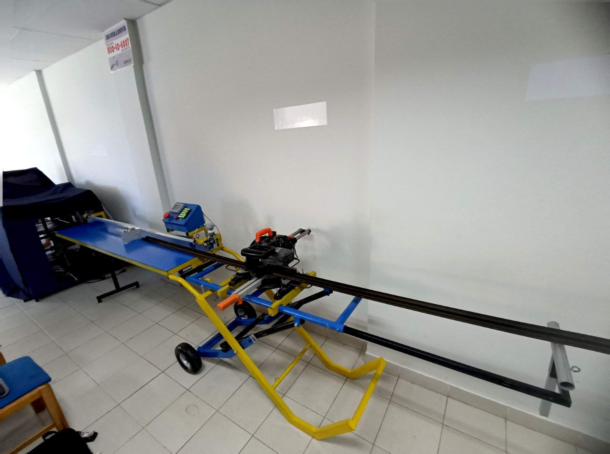
*Vista general de la maquinaria automatizada lista para operación.*

<table style="width:100%">
  <tr>
    <td>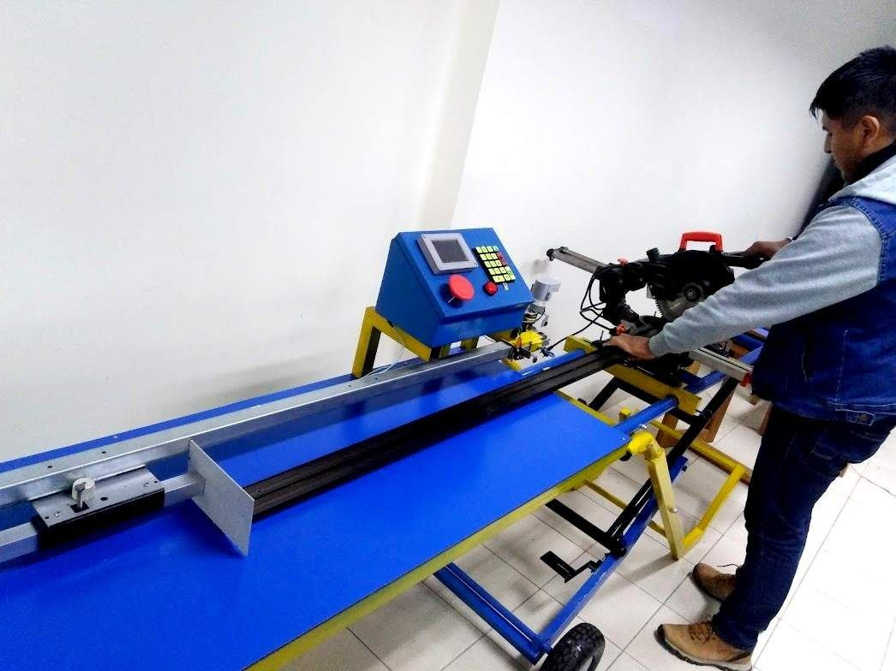</td>
    <td>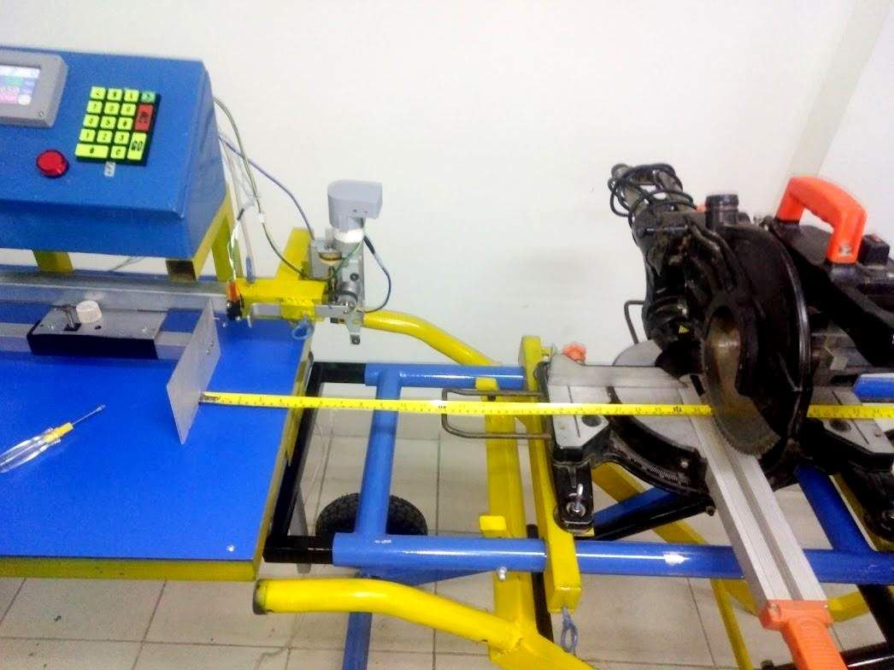</td>
  </tr>
</table>
*Izquierda: Operación del sistema de corte. Derecha: Verificación física de la precisión digital mediante medición directa.*
